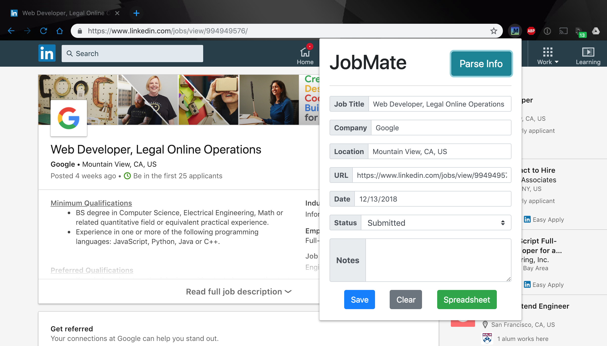

# JobMate (version 1.4)
A [Chrome extension](https://chrome.google.com/webstore/detail/jobmate/dhehfnkpbknogddkkiabopofhkcimcle) to parse job details on common job boards and store the information on Airtable

## Currently supported job boards:
- glassdoor.com
- lever.co
- greenhouse.io
- angel.co
- indeed.com
- linkedin.com (updated in v1.4)
- stackoverflow.com (updated in v1.4)
- monster.com (updated in v1.4)
- ziprecruiter.com (updated in v1.4)
- hire.withgoogle.com (added in v1.4)
- jobvite.com (added in v1.4)
- workable.com (added in v1.4)

## Setup
1. You need to have [Airtable](https://airtable.com) account (free to register)

2. Go [here](https://airtable.com/account) to generate an **API Key**

3. Create a workspace and a base that has the following columns: ([example](https://airtable.com/shrN2JjV4nfk1nDR9/tblie1Q7Z9fctLcF0))
   - **Company** (single line text)
   - **Position** (single line text)
   - **Location** (single line text)
   - **URL** (single line text)
   - **Applied On** (date)
   - **Notes** (long text)
   - **Status** (single select, options: Submitted, Working, Rejected, Pending)

4. (Optional) Obtain the direct URL to access the base just created in step 2 from your browser's address bar

5. Go [here](https://airtable.com/api) to select the base you just created:
   - Obtain the Base ID from the address bar (https://airtable.com/**__BASEID__**/api/docs)
   - Obtain Table Name

6. Install JobMate chrome extension [here](https://chrome.google.com/webstore/detail/jobmate/dhehfnkpbknogddkkiabopofhkcimcle)
7. Right click on the newly added JobMate icon on chrome toolbar and select **Options**
   - You should see a popup window to fill out your Airtable API Key, Base ID, and Table Name, and Base URL
   - **JobMate chrome extension will not work properly if the first 3 parameters are missing**. The 4th parameter (Base URL) is for your easy access, the green SPREADSHEET button located in extension popup will not work if this parameter is missing
   - Click SAVE when you are done, this will allow JobMate to store information on Airtable that you can refer to later

   

## Tech
- jQuery
- Bootstrap
