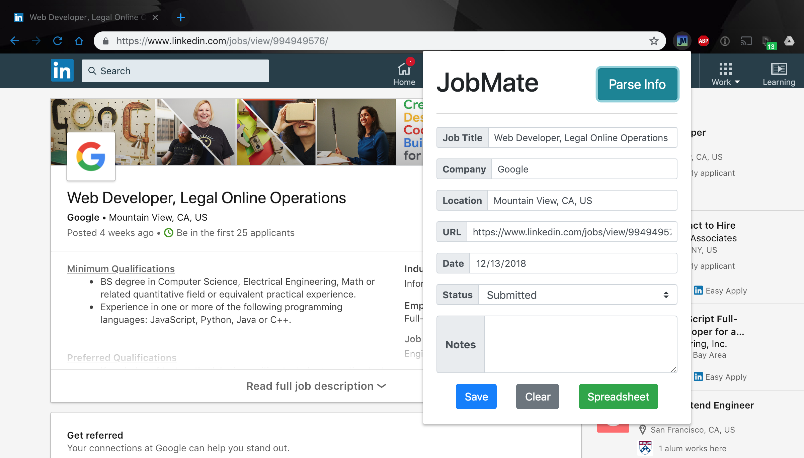
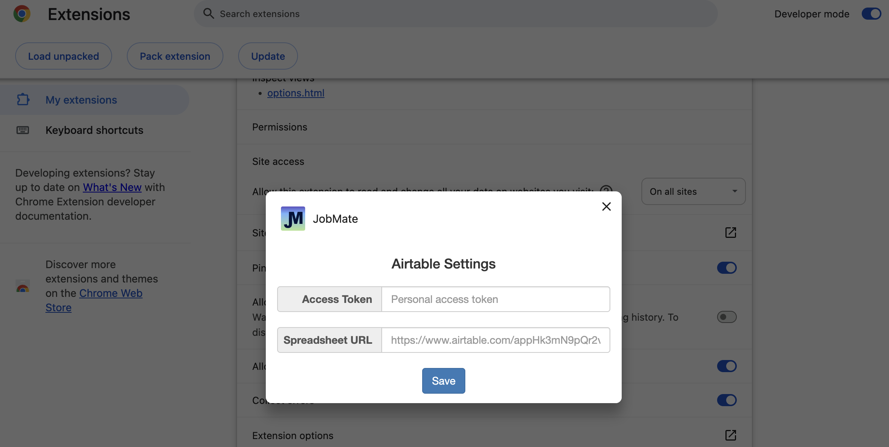

# JobMate (version 1.5)

A [Chrome extension](https://chrome.google.com/webstore/detail/jobmate/dhehfnkpbknogddkkiabopofhkcimcle) to parse job details on common job boards and store the information on Airtable

## Currently supported job boards and ATS platforms:

- ashbyhq.com (added in v1.5)
- gem.com (added in v1.5)
- glassdoor.com
- greenhouse.io
- icims.com (added in v1.5)
- indeed.com
- jobvite.com (added in v1.4)
- lever.co
- linkedin.com (updated in v1.4)
- monster.com (updated in v1.4)
- myworkdayjobs.com (added in v1.5)
- taleo.net (added in v1.5)
- welcometothejungle.com (formerly otta.com) (added in v1.5)
- wellfound.com
- workable.com (added in v1.4)
- ziprecruiter.com (updated in v1.4)

## Setup

1. Go [here](https://chrome.google.com/webstore/detail/jobmate/dhehfnkpbknogddkkiabopofhkcimcle) to install JobMate Chrome extension.

2. You need to have [Airtable](https://airtable.com) account (free to register)

3. Create a spreadsheet (aka a base) that has the following columns: ([example](https://airtable.com/shrN2JjV4nfk1nDR9/tblie1Q7Z9fctLcF0))
   - **Company** (single line text)
   - **Position** (single line text)
   - **Location** (single line text)
   - **URL** (single line text)
   - **Applied On** (date)
   - **Notes** (long text)
   - **Status** (single select, options: Submitted, Working, Rejected, Pending)

4. Create an Airtable **personal access token**:
   - Open the [Airtable developer hub](https://airtable.com/create/tokens) and create a token.
   - Add scopes **`data.records:read`** and **`data.records:write`** (required to create rows from the extension).
   - Under access, include the **base** you want to use for storing data.
   - Copy the token once and store it in JobMate Options.

5. Open the spreadsheet created in step #3. Copy the full **URL from your browser’s address bar** — it should look like `https://airtable.com/app…/tbl…/…` (both the `app…` base id and `tbl…` table id must appear in the path).

6. Right click the JobMate toolbar icon → **Options**
   - Enter your **Access Token** and **Spreadsheet URL** (from step #4 and #5).
   - Click **Save** when you are done.

   

## Tech

- jQuery
- Bootstrap
