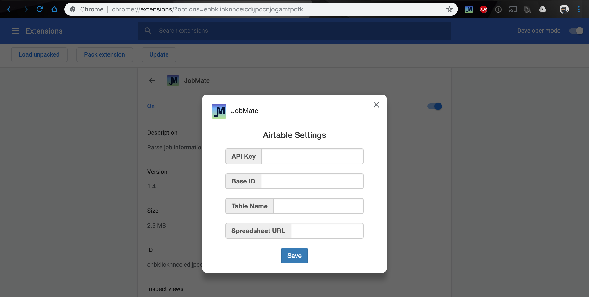

# JobMate (version 1.0)
A [Chrome extension](https://chrome.google.com/webstore/detail/jobmate/dhehfnkpbknogddkkiabopofhkcimcle) to parse job details on common job boards and store the information on Airtable

## Currently supported job boards:
- linkedin.com
- glassdoor.com
- lever.co
- greenhouse.io
- angel.co
- stackoverflow.com
- indeed.com
- monster.com
- ziprecruiter.com

## Setup
1. You need to have [Airtable](https://airtable.com) account (free to register)

2. Go [here](https://airtable.com/account) to generate an **API Key**

3. Create a workspace and a base that has the following columns: ([example](https://airtable.com/shrN2JjV4nfk1nDR9/tblie1Q7Z9fctLcF0))
   - **Company** (single line text)
   - **Position** (single line text)
   - **Location** (single line text)
   - **URL** (single line text)
   - **Applied On** (date)
   - **Notes** (long text)
   - **Status** (single select, options: Submitted, Working, Rejected, Pending)
   
4. Go [here](https://airtable.com/api) to select the base you just created:
   - Obtain the Base ID from the address bar (https://airtable.com/**__BASEID__**/api/docs)
   - Obtain Table Name

5. Install JobMate chrome extension [here](https://chrome.google.com/webstore/detail/jobmate/dhehfnkpbknogddkkiabopofhkcimcle)
6. Right click on the newly added JobMate icon on chrome toolbar and select **Options**
   - You should see a popup window to fill out your Airtable API Key, Base ID, and Table Name
   - **JobMate chrome extension will not work if these 3 parameters are missing**
   - Click save when you are done, this will allow JobMate to store information on Airtable that you can refer to later.

   

## Tech
- jQuery
- Bootstrap
